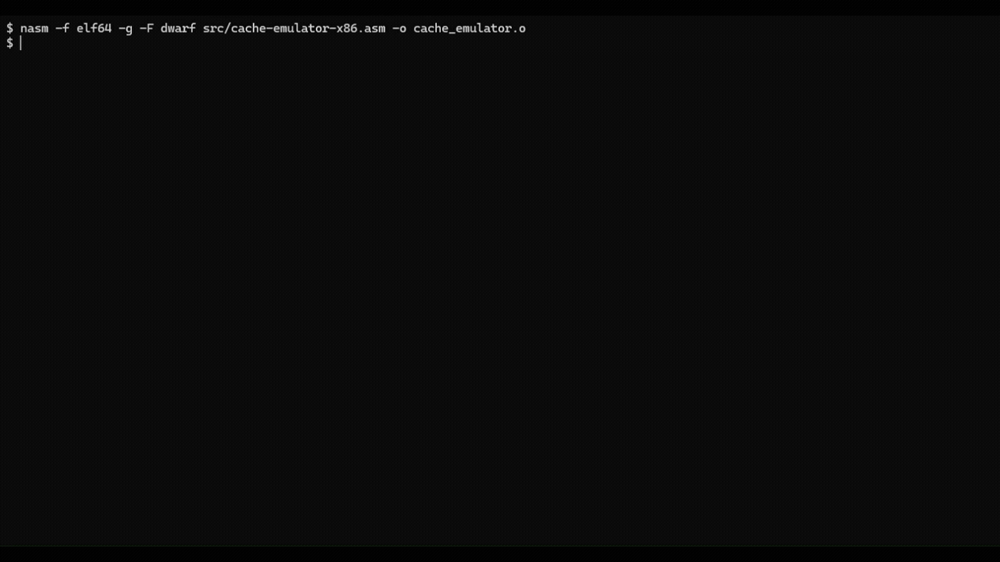

# x86-64 NASM Cache Emulator

A robust, low-level cache memory simulator written in x86-64 NASM Assembly. This project emulates a direct-mapped cache architecture and strictly adheres to standard Linux ABI conventions.

## Technical Specifications

- **Architecture:** Direct-mapped cache simulation.
- **Addressing:** 16-bit physical addresses decomposed into:
    - 10-bit Tag
    - 4-bit Index
    - 2-bit Offset
- **ABI Compliance:** Fully compliant with the System V AMD64 ABI, ensuring strict 16-byte stack alignment and meticulous preservation of callee-saved registers (`r12`-`r15`).
- **Memory Management:** Implements precise bit-masking and bit-shifting operations to isolate address components and prevent data contamination across execution cycles.

## Engineering Challenges & Optimizations

Building a low-level simulator in raw Assembly requires control over hardware resources. During development, several critical systems-level challenges were tackled:

- **Strict System V ABI Compliance:** Ensured that the 16-byte stack alignment rule was meticulously maintained before any external function calls. Callee-saved registers (`r12` to `r15`) were protected and used for state persistence across execution cycles.
- **State Optimization & Control Flow:** Re-engineered the conditional branch logic to handle multi-argument processing efficiently. Shifted critical execution loop counters from volatile registers to callee-saved registers (`r14`, `r15`), successfully resolving segmentation faults and avoiding redundant system calls.
- **Memory Isolation:** Implemented precise bit-masking operations (isolating the 10-bit tag, 4-bit index, and 2-bit offset) to strictly prevent any data contamination within the simulated direct-mapped structure.

## Project Structure

```text
├── img/
│   └── exec_demo.gif        # Visual execution preview
├── src/
│   └── memoria_cache.asm    # Core emulator logic and ABI interface
├── .gitignore               # Build and environment exclusions
└── README.md                # Project documentation
```

## Compilation and Execution

This project interfaces with an external static library (`biblioteca.o`) for display routines.

```bash
# Assemble the source code
nasm -f elf64 -g -F dwarf src/cache-emulator-x86.asm -o cache_emulator.o

# Link with the external library
gcc -no-pie cache_emulator.o biblioteca.o -o cache_emulator -nostartfiles -fPIE -no-pie -lncurses

# Run the simulator (Example)
./cache_simulator Bb @b
```

### Controls & Simulation Flow

Advance/Exit: Press q to progress through the memory access cycles.

## Visual Demonstration

Here is a preview of the emulator in action, showcasing the terminal-based GUI, real-time cache state updates, and address breakdown validation:



## Automated Verification & Trace Logs

The emulator outputs an execution trace (`operation_log.txt`) matching the simulation runtime metrics. This log captures the sequential state machine transitions for each memory access cycle, detailing the Cache Index, decoded Tag values, and the Hit/Miss outcome status:

```text
Operation | Index | Tag   | Status/Result
-----------------------------------------
3         | 13    | 99    | 99    (Cycle Start)
2         | 13    | 99    | 99    (Tag Evaluation)
5         | 13    | 393   | 99    (Target Address Decoded)
1         | 13    | 99    | 2     (Cache Miss - Allocation)
```

This deterministic logging ensures the core Assembly logic can be thoroughly tested and verified against expected architectural hardware behavior.

Note on Academic Integrity & IP: The external object file (`biblioteca.o`) is omitted from this repository to protect intellectual property guidelines and strictly comply with university academic policies.
